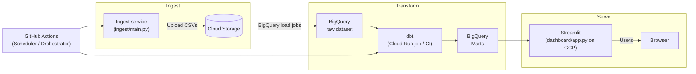
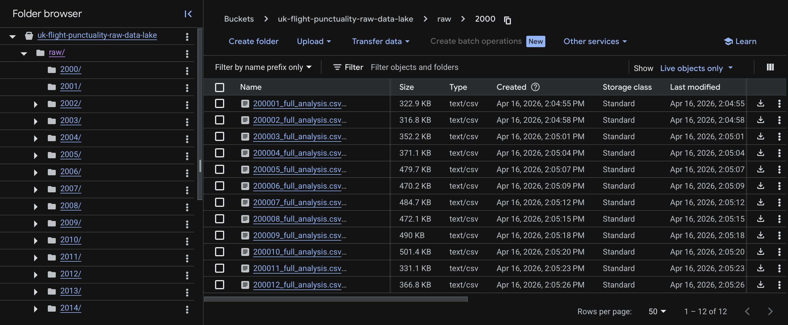
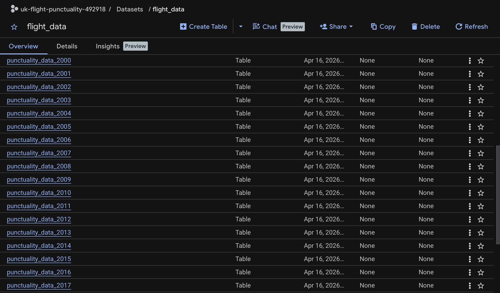
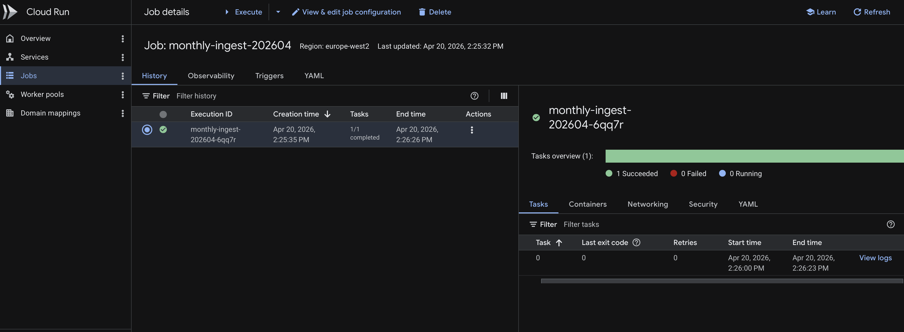
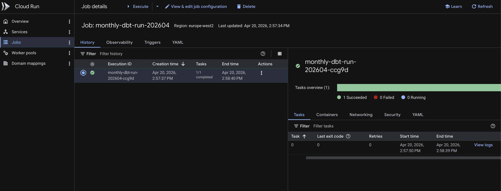
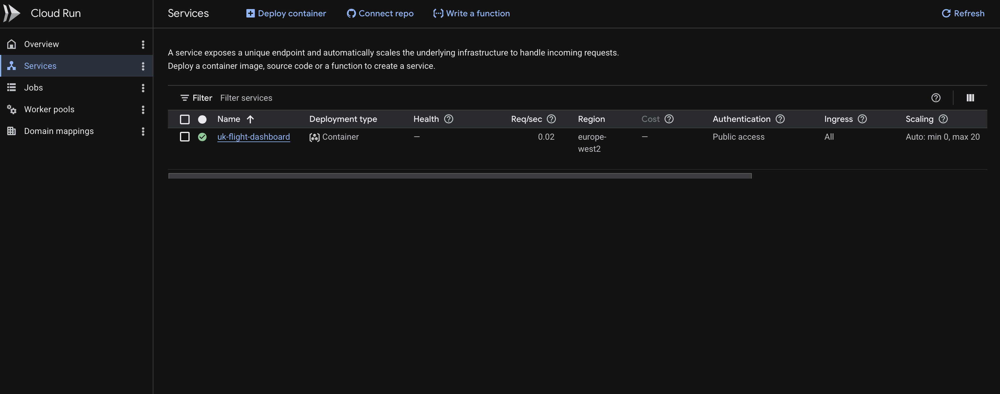
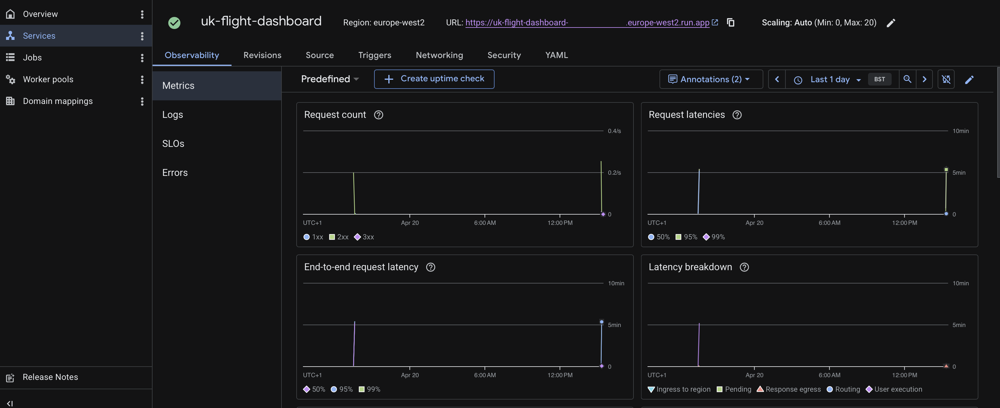
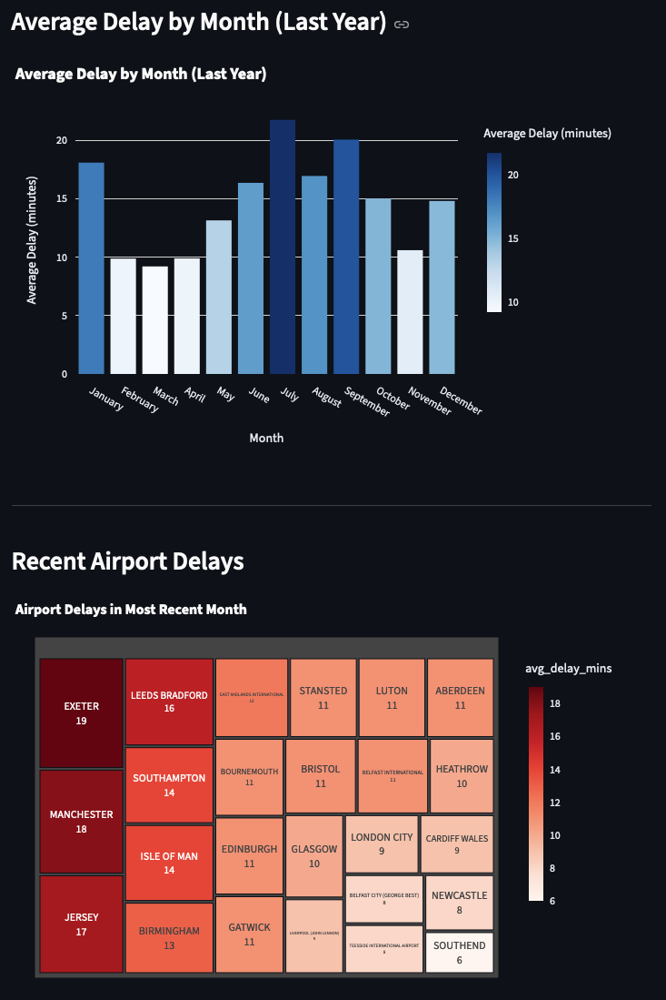

# UK Flight Punctuality Analytics

This repository is the capstone project for Data Engineering Zoomcamp by [DataTalks.Club](https://www.datatalks.club/). It contains a data pipeline and analytics project focused on UK flight punctuality. The project ingests flight data from the UK Civil Aviation Authority, processes it, and provides insights through a Streamlit dashboard.

# Problem Statement
As a frequent flyer, the question arises: which UK airlines, airports consistently delay their flights, impacting passenger experience and time? This analysis aims to identify patterns in UK flight delays by airline, airport, and time period. 

# Requirements
- Unix-based system (macOS, Linux). Alternatively, you can use GitHub Codespaces.
- A Google Cloud Platform account with the following APIs enabled: BigQuery API, Cloud Storage API, and Cloud Run API. 

# Technologies
- **Data Ingestion**: Python (pandas, BeautifulSoup, requests)
- **Data Warehouse**: Google BigQuery
- **Data Transformation**: dbt (data build tool)
- **Dashboard & Visualization**: Streamlit
- **Infrastructure as Code**: Terraform
- **Containerization**: Docker, Docker Compose
- **Cloud Platform**: Google Cloud Platform (BigQuery, Cloud Storage, Cloud Run, Container Registry)
- **Package Management**: uv
- **CI/CD**: GitHub Actions
- **Orchestration**: GitHub Workflows

# Project Structure
- `ingest/`: Data ingestion and processing code. Can be run locally or triggered in Cloud Run via GitHub workflow.
- `dbt/`: dbt project for data transformation and modeling. Runs locally or on Cloud Run via GitHub workflow.
- `dashboard/`: Streamlit app for data visualization and analytics. Runs locally or on Cloud Run via GitHub workflow.
- `infra/`: Terraform configuration for provisioning infrastructure on Google Cloud Platform.
- `set_up.py`: Setup script for the project environment and profiles. Configures environment variables, dbt profiles, and builds Docker images for the ingest, dbt, and dashboard applications, pushing them to Google Container Registry for use in Cloud Run.

# Architecture

The high-level architecture of the project (ingest → storage → transformation → dashboard):




# Getting Started
1. Create a Google Cloud project and enable the required APIs (BigQuery, Cloud Storage, Cloud Run, Artifact Registry). Reference: [DE Zoomcamp 1.3.2 - Terraform Basics](https://youtu.be/Y2ux7gq3Z0o?si=5r3IQlOst9R9p_sk). Note your project ID.
2. Create a service account with the following permissions: Artifact Registry Admin, BigQuery Admin, Storage Admin, Cloud Run Admin, and IAM Admin. Generate and download a JSON key, then place it in the `keys/` folder and name it `my-creds.json`.
3. Create a virtual environment and install dependencies using `uv sync` in the root of the repository.
4. Set the `GCP_PROJECT` environment variable to your Google Cloud project ID in the `.env` file. You can add environment variables to a `.env` file in the root of the repository. Update the `GCP_PROJECT` variable with your project ID and ensure `GCP_REGION` is set to your desired region (e.g., `europe-west2`).
5. Export Google Application Credentials environment variable to point to your service account key file. This is required for local runs of the ingestion and dashboard applications. For example:
```bash
export GOOGLE_APPLICATION_CREDENTIALS="/path/to/your/keys/my-creds.json"
```
You can copy this path by right-clicking on the `my-creds.json` file in your file explorer and selecting "Copy Path".
6. Configure Terraform to use your Google Cloud project by setting the `project` variable in `infra/variables.tf` to your project ID. Similarly, set the `region` variable to your desired region (e.g., `europe-west2`). These variables are used in the Terraform configuration to create resources in the correct project and region.
7. Install Terraform and initialize the working directory for Terraform in the `infra/` folder by running `terraform init`. This will download the necessary provider plugins and set up the backend for storing state.
Install Terraform in Codespaces by running:
```bash
wget -O - https://apt.releases.hashicorp.com/gpg | sudo gpg --dearmor -o /usr/share/keyrings/hashicorp-archive-keyring.gpg
echo "deb [arch=$(dpkg --print-architecture) signed-by=/usr/share/keyrings/hashicorp-archive-keyring.gpg] https://apt.releases.hashicorp.com $(grep -oP '(?<=UBUNTU_CODENAME=).*' /etc/os-release || lsb_release -cs) main" | sudo tee /etc/apt/sources.list.d/hashicorp.list
sudo apt update && sudo apt install terraform
```
8. Provision infrastructure using Terraform. Run `terraform plan` and `terraform apply` in the `infra/` directory. This creates a BigQuery dataset, Cloud Storage bucket, and Cloud Run services.
9. Create github secrets for your repository. This is for github workflows to authenticate with Google Cloud and run ingestion/dbt/dashboard in Cloud Run. The required secrets are:
   - `GCP_PROJECT`: Your Google Cloud project ID
   - `GCP_REGION`: europe-west2 (or the region you specified in Terraform variables)
   - `GCP_SA_KEY`: The contents of your service account JSON key file
To find secrets, please, navigate to your repository on GitHub -> Settings -> Secrets and variables -> Actions -> New repository secret.
9. Run `uv run set_up.py --project <YOUR_GCP_PROJECT_ID>` to set up the environment. This creates dbt profiles for BigQuery authentication and builds Docker images for the ingest, dbt, and dashboard applications, pushing them to Google Container Registry. 

### Schedule GitHub workflows
The last step 9 is necessary to set up the environment and build Docker images for Cloud Run. However, you can skip it if you only want to run the ingestion, dbt, and dashboard applications locally. The GitHub workflows are configured to use the images built by this setup script, so if you skip it, the workflows will fail to run in Cloud Run until you build and push the images manually.


After setup, you can run the ingestion, dbt, and Streamlit dashboard locally or trigger GitHub workflows to run them in Cloud Run.

## Running Locally / Codespaces
- Ingest data: `uv run ingest/main.py`. This will download the flight data, process it, and load it into BigQuery for the specified year(s).
After the ingestion, the Cloud Storage will look:

The BigQuery dataset will contain tables like `punctuality_data_2000`, `punctuality_data_2001`, etc. with the raw ingested data under the configured dataset.

- In order to run dbt transformations, you need to set up profiles.yml for dbt. Previously mentioned `uv run set_up.py` command only create profiles_container.yml to be used in the container. This yaml file sets OAuth authentication in Google Cloud. For local runs, you must create a `profiles.yml` in the `dbt/` directory with the following content:
```yaml
uk_flight_punctuality:              # your profile name (same as in dbt_project.yml)
  target: dev
  outputs:
    dev:
      type: bigquery
      method: service-account                # or "oauth" if you want user‑based auth
      project:                               # your Google Cloud project ID
      dataset: flight_data                   # BigQuery dataset for dev
      threads: 1                             # number of parallel queries
      timeout_seconds: 300                   # query timeout in seconds
      location: europe-west2                 # BigQuery location (e.g. US, EU, us‑west2)
      priority: interactive                  # or "batch"
      keyfile: path/to/your/service_account_key.json 
      retries: 1
```
Make sure to replace `path/to/your/service_account_key.json` with the actual path to your service account key file (e.g., `../keys/my-creds.json` if your `profiles.yml` is in the `dbt/` directory and your key is in the `keys/` directory at the root of the repo).
- Navigate to dbt folder through the terminal - `cd dbt`. Run dbt transformations: `uv run dbt run`.
- Run Streamlit dashboard: `uv run streamlit run dashboard/app.py`. This will start the Streamlit app locally, which you can access at `http://localhost:8501` or the link provided in the terminal output. In VS Code, you can also click on Ports in the bottom panel, find the forwarded port for Streamlit, and click "Open in Browser" to access the dashboard. If your browser does not open the dashboard, try to use the other browser. 

## Running in Cloud Run via GitHub Workflows
- Trigger the ingestion workflow: Go to the "Actions" tab in your GitHub repository, find the workflow named "Ingest Data to BigQuery", and click "Run workflow". This will execute the ingestion process in Cloud Run, which will download, process, and load the flight data into BigQuery. Go to Cloud Run in your Google Cloud Console to monitor the execution of the ingestion service, through 'View logs'. After the workflow completes, check BigQuery to see the newly ingested tables.

- After completion of the ingestion workflow, trigger the dbt workflow: Go to the "Actions" tab, find the workflow named "Scheduled GCP dbt run", and click "Run workflow". This will execute the dbt transformations in Cloud Run, creating the necessary tables and views for the dashboard. Monitor the execution in Cloud Run and check BigQuery after completion to see the new tables/views created by dbt.

- Finally, trigger the dashboard workflow: Go to the "Actions" tab, find the workflow named "GCP dashboard run", and click "Run workflow". This will deploy the Streamlit dashboard to Cloud Run. After deployment, navigate to Cloud Run in your Google Cloud Console, find the service named "dashboard-service", and click on it. You will see a URL for the deployed dashboard. Click on the URL to access the Streamlit dashboard running in Cloud Run.



# Data

## Data Source
The data is sourced from the UK Civil Aviation Authority (CAA) and contains detailed information on flight punctuality for UK airports. The dataset includes records from the year 2000 through 2025.

## Data Schema
Key fields in the unioned BigQuery table (used by dbt and the dashboard):

- `year` (INTEGER) — reporting year
- `month` (INTEGER) — reporting month
- `reporting_period_date` (DATE) — canonical partition date
- `reporting_airport` (STRING) — airport code
- `origin_destination` (STRING) — origin–destination pair
- `origin_destination_country` (STRING) — route country
- `airline_name` (STRING) — carrier name
- `scheduled_charter` (STRING) — scheduled/charter flag
- Counts (INTEGER): `number_flights_matched`, `actual_flights_unmatched`, `planned_flights_unmatched`, `number_flights_cancelled`
- Delay metrics (FLOAT): delay percentage bands and aggregates such as `early_to_15_mins_late_percent`, `0_to_15_mins_late_percent`, `flts_16_to_30_mins_late_percent`, `flts_31_to_60_mins_late_percent`, `flts_61_to_180_mins_late_percent`, `flts_181_to_360_mins_late_percent`, `more_than_360_mins_late_percent`, `average_delay_mins`, plus `flights_unmatched_percent` and `flights_cancelled_percent`.

## Data Models
dbt models are defined in the `dbt/models/` directory. The repo stages a
year-by-year unioned source into dbt and builds a small set of final marts
consumed by the Streamlit dashboard.

The raw unioned source table (`punctuality_data_all_years`) is staged in dbt as
`stg_punctuality_data`. The staging model is materialized as a table and is
partitioned by `reporting_period_date` (date) and clustered by
`origin_destination` and `airline_name`:

- Partitioning: enables date-range pruning so queries that target recent months
   or years scan far less data (reducing BigQuery cost and improving latency).
- Clustering: colocates rows by origin/destination and airline, which speeds
   aggregations and group-by operations used by downstream models.

A lightweight intermediate view, `int_scheduled_flights`, filters the staged
data to scheduled flights only (`scheduled_charter = 'S'`) and serves as the
canonical source for mart-level aggregations.

Final mart models used by the Streamlit dashboard (only these are required by
the app):

- `fct_delay_over_years` — annual average delay (used for the "Annual Average
   Delay Trend" chart).
- `fct_delay_vs_month_last_year` — monthly average delays for the most recent
   year (used for the "Average Delay by Month (Last Year)" chart).
- `fct_recent_airport_delays` — average delay per reporting airport for the
   most recent month (used for the "Recent Airport Delays" treemap).
- `fct_recent_number_tracked_flights` — total tracked flights in the most
   recent period (dashboard metric).
- `fct_recent_published_date` — human-readable most-recent reporting month/year
   (dashboard metric).

Materialization summary:

- Staging: `stg_punctuality_data` is a partitioned & clustered table to
   optimize cost and query performance for time-based analytics.
- Intermediate: `int_scheduled_flights` is a view to keep transformations
   lightweight and avoid duplicating storage for filtered data.
- Marts: final models are materialized as tables to provide fast, stable read
   performance for the dashboard.

Only the models listed above are included in the deployed Streamlit app; other
dbt models in the project exist for exploration or auxiliary analyses and are
not required for dashboard rendering.

## Data Tests

This project includes a small set of dbt tests that validate key assumptions in the staging model (`stg_punctuality_data`). They run as part of local dbt checks and CI to catch data-quality regressions early.

- `test_stg_non_negative_counts.sql` — asserts that count-like fields are never negative (e.g., `number_flights_matched`, `actual_flights_unmatched`, `planned_flights_unmatched`, `number_flights_cancelled`).
- `test_stg_percent_bounds.sql` — asserts percent fields fall within the 0–100 range (e.g., `flights_cancelled_percent`, `flights_unmatched_percent`, `more_than_360_mins_late_percent`).

Tests are also defined in corresponding schemas for the staging model in `dbt/models/staging/schema.yml` and `dbt/models/intermediate/schema.yml` as part of the dbt test suite. Particularly, the `not_null` tests are set in the former one and `unique` test is set for the `unique_row_id` field in the intermediate model `int_scheduled_flights`.ß

How to run tests locally:

```bash
cd dbt
uv run dbt test
```

# Dashboard Visualizations
The Streamlit dashboard provides the following visualizations and interactive controls used to explore UK flight punctuality trends and metrics.

- `Annual Average Delay Trend` — line chart showing the annual average delay (minutes) for scheduled flights. Use the year range selector to focus on specific periods and the airline filter to compare carriers.
- `Average Delay by Month (Last Year)` — bar/line chart that displays monthly average delays for the most recent complete year to highlight seasonal patterns.
- `Recent Airport Delays` — treemap (or choropleth-style visual) showing average delay by reporting airport for the most recent reporting period. Hover to see exact values and click to filter other charts.
- `Recent Number of Tracked Flights` — KPI metric showing the total number of tracked flights in the most recent period; updates with filters.
- `Most Recent Published Date` — KPI metric showing the most recent reporting month and year in a human-readable format.



# Future Improvements / Work in Progress
- Add black/isort pre-commit hooks for code formatting and linting.
- Delete irreleval data models in dbt/intermediate/ and dbt/marts/ that are not used by the Streamlit app to reduce confusion and maintenance overhead.
- Simplify the terminal commands for running the ingestion, dbt, and dashboard applications locally by creating dedicated scripts or Makefile targets that encapsulate the necessary environment variable exports and command invocations.
- Add dbt models comparing low-cost airlines flying from UK.
- Add interactive filters to the Streamlit dashboard to allow users to explore delays by airline, origin/destination pairs, and other dimensions.

# Thank you!
Thank you for checking out this project! If you have any questions or feedback, feel free to open an issue or reach out to me by 47990682+oleheyko@users.noreply.github.com. 